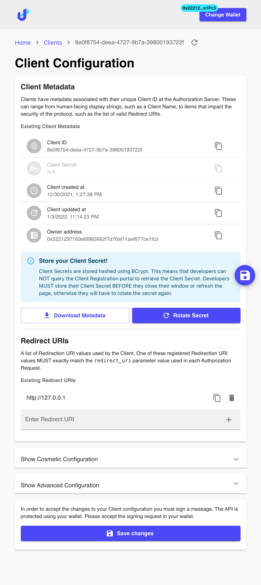
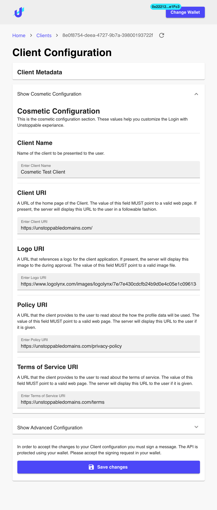

# Login Client Configuration

The default configuration for the Login Client works right out of the box for local development and all [Login Scopes](scopes-for-login.md) are enabled by default. The minimum viable configuration for the Login with Unstoppable client is the **client ID** and **redirect URIs**, which is established in the [Client Metadata](login-client-configuration.md#step-2-client-metadata-configuration) section (Step 2 below).

:::danger
Developers must store the client secret before saving changes, refreshing the page, or exiting the page. The client secret cannot be retrieved by Unstoppable Domains.
:::

## Step 1: Add a New Client to Your Account

* Visit the [My Clients](https://dashboard.auth.unstoppabledomains.com) page after your application has been submitted to view all of the clients associated with your wallet address.
* Take any of the following actions on this page:
  * Click **Change Wallet** button to signin with a different wallet and see clients associated with a different wallet address.
  * Click the gear  to modify an existing client configuration.
  * Click the trash can  to delete or remove a client from your account.
  * Click **Create Client** button to add a new client.

## Step 2: Client Metadata Configuration

The **Client Metadata** section includes the unique client ID, client secret, and redirect URIs. Developers can also download metadata for the existing client configuration and rotate the client secret from within this sub-section.

### Rules for Redirect URIs

The Redirect URIs follow three rules:

1. Http URI resolves to local host (http://127.0.0.1 or http://localhost). If you specify a local host, then the system does not care about the port.
2. If using https website, then can only have a single https redirect URI or will get an error.
3. All URIs must use the same origin name (e.g., unstoppabledomains.com) or will get an error.

:::info
Local host is okay for test development, but 127.0.0.1 should be used for live environments. It is best practice to use a hardcoded IP address in a live environment instead of the local host.
:::

## **Step 3: Cosmetic Configuration (Optional)**

The **Cosmetic Configuration** allows developers to customize the UI to improve the user experience. This includes updating or modifying the client name presented to the user, client URI, logo URI, policy URI, and terms of service URI.

:::warning
All URIs must use the same origin name (e.g., unstoppabledomains.com) or will get an error. This rule applies to client URI, policy URI, and terms of service URI.
:::

The following table describes the fields for the cosmetic configuration UI section.

| Cosmetic Config Field | Description                                                                                                                 |
| --------------------- | --------------------------------------------------------------------------------------------------------------------------- |
| Client Name           | The client name as presented to user; display name of the Client URI hyperlink.                                             |
| Client URI            | By default, the value of the hyperlink is the redirect URI (from Client Metadata area) unless client URI field is complete. |
| Logo URI              | If provided, the Logo URI will retrieve the logo image and display the logo directly above client name.                     |
| Policy URI            | Policy URI will display at the bottom of the UI.                                                                            |
| Terms of Service URI  | ToS URI will display at the bottom of the UI.                                                                               |

## Step 4: Advanced Configuration (Optional)

The **Advanced Configuration** includes options for CORS, audience URIs, grant types, response types, scopes, and token endpoint auth method.

:::danger
The advanced configuration settings are unnecessary for many configurations and could break existing Login integrations.
:::

The following section describes the fields for the advanced configuration UI section.

### Allowed CORS Origins

CORS is a browser protocol for accessing info from another domain. If a URI is entered, CORS is enabled for all requests from that client. Developers can enter the origin URI and specify the port. The Token, UserInfo, and Revocation endpoints all respect this option.

:::warning
The initial authorization endpoint that users are redirected to cannot use CORS; it will not work.
:::

### Audience URIs

:::info
This only needs to be configured if using an API that requires an audience URI.
:::

These URIs represent the audience that is inside the access token JWTs. You get back an access token and ID token and both are JWTs. The access token is opaque.

* For the ID token, the audience are the clientIDs.
* For the access token, the audience is the resource servers; those resource server URLs are the audience for the access token.

### Grant Types

There are two ways to request an access token: authorization code and refresh token.

* **auth code:** short lived, used to initially get the session with the user, corresponds to _authorization\_code grant type_
* **refresh token:** lives longer, used to maintain a session, receive an extra token to re-authenticate users later for a certain period of time, corresponds to the _offline grant type_

### Response Types

There are three response types: authorization code, access token, ID token.

* **auth code:** more secure; returns authorization code which you exchange for authorization
* **access token:** implicit flow, not recommended because it is less secure; no code but you receive ID or access token
* **ID token:** hybrid flow; receive all three: access code, access token, and/or ID token

:::danger
All authorization code requests or flows must use the PKCE extension. This only refers to the authorization code response type.
:::

### Scopes

All [scopes](scopes-for-login.md) are turned on by default. To limit the scopes that the application can request, simply uncheck or disable those scopes.

* **wallet** maps to the [wallet scope](scopes-for-login.md#wallet-scope)
* **email** maps to the [email scope](scopes-for-login.md#email-scope)
* **email:optional** maps to the [email:optional scope](scopes-for-login.md#emailoptional-scope)
* **humanity_check** maps to the [humanity_check scope](scopes-for-login.md#humanitycheck-scope-mark-style"colorred"betamark)
* **humanity_check:optional** maps to the [humanity_check:optional scope](scopes-for-login.md#humanitycheckoptional-scope-mark-style"colorred"betamark)

### Token Endpoint Authentication Method

:::info
This setting cannot use for front-end integrations. It can only be enabled for applications, such as servers, that can store secrets.
:::

This setting configures how to send the client secret to the authorization server after you receive the authorization code; can be enabled for an extra layer of security but can only be used if your application can store secrets (e.g., node.js integrations). The client secret is stored on server as a hash, so authorization server doesn't actually know the client secret. See additional resource for [Client Basic and Client Secret oAuth](https://datatracker.ietf.org/doc/html/rfc6749#section-2.3.1).

* **client secret basic:** uses http basic authentication to send over clientid:clientsecret inside the header, which is base64 encoded.
* **client secret post:** uses http POST authentication to send over client\_secret parameter inside the body.

:::danger
**WARNING: Copy** and **Save** the Client Secret as soon as the Token Authentication Method has been changed/saved because the client secret will not re-appear after the page is refreshed. If you lose the client secret after the application goes live, then the only way to change the secret is to rotate it and immediately download the client metadata, so you have a copy of the client configuration (to create a new client with new login credentials).
:::

## Step 5: Save Changes

You must save any changes made to the configuration options before they will take effect. For enhanced security, any changes made to update the application requires a wallet connection and signature.

:::info
**Reminder:** Developers must store the client secret before saving changes, refreshing the page, or exiting the page. It is also recommended that developers periodically download and save the current client configuration JSON file from the [Client Metadata](login-client-configuration.md#step-2-client-metadata-configuration) section.
:::

:::success Congratulations!
You finished configuring your Login with Unstoppable client.
:::
